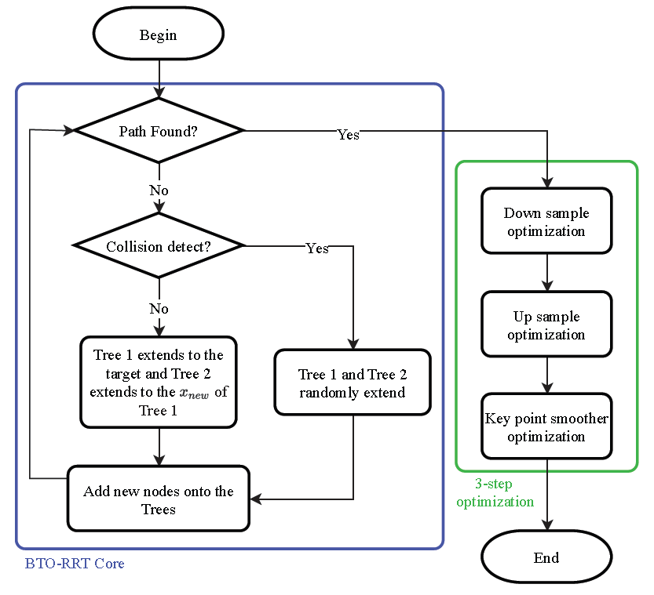

# BTO-RRT: A rapid, optimal, smooth and point cloud-based path planning algorithm

The flowchart of BTO-RRT algorithm: 



## 1 Prerequisites

MATLAB >= 2019a

## 2 Quick start

### 2.1 2D Map Demo

To run and see the effect of BTO-RRT algorithm immediately on 2d maps, you can run `code/final_algorithm_2D/main_v4_core.m`

You should be able to see the following:


You can change the following `load settings` in the code line 2-7 and see more:

```matlab
%% load settings
name = 'map7';
%name = 'BTO_example';
% type = '.jpg';
type = '.bmp';
%type= '.png';
```

### 2.2 3D Point cloud maps demo

To run and see the effect of BTO-RRT algorithm immediately on 3d point cloud maps, you can run `code/pointcloud_3D/pointcloud_RRTV2m_1.m` 

You should see something similar to the following:


If you run `code/pointcloud_3D/pointcloud_RRTV2m_2.m`, you should see two figures as follow:


## 3 Analysis

### 3.1 Down-sample

To see the fig. 3 in the paper, please run `code/Analysis/down_sample/test1.m`

You should something similar to the fig.3: 


### 3.2 Up-sample

To see fig. 4, please run `code/Analysis/up_sample/test4_upsample.m`  and by changing the code  at line 22:

```matlab
itermax = 100; % 10 or 1000
```

You should see the following figures with different `itermax`


